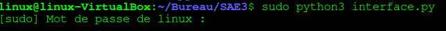
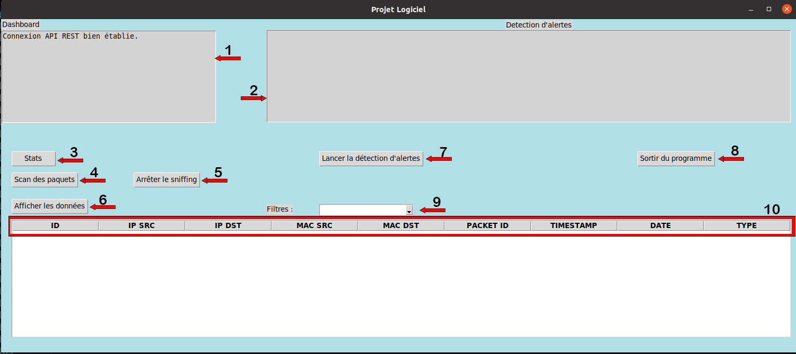
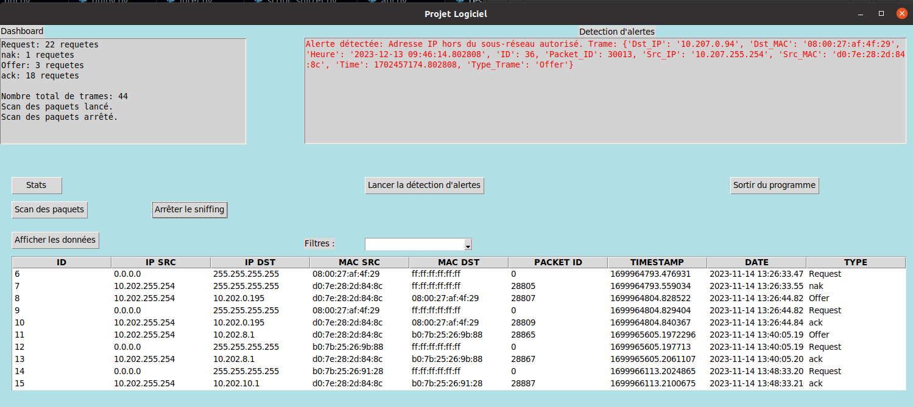

# Manuel d'utilisation
## Presentation de l'interface graphique et ses fonctions

Pour lancer le script et avoir toutes les fonctionalités, il faut le faire en **sudo**, une fois que le module sniff il est présent dans l'interface et il marche qu'en **sudo**.

#### Lancement
**commande**: sudo python3 interface.py

**Legende:**

- 1 : Dashboard: Il affiche les infos necessaires, comme si la connexion avec l'API rest est etablie ou pas, les statisques, et la éxecution de scan de paquets
- 2 : Il nous affiche en rouge les alertes, il montre toute la trame en entier.
- 3 : Ce bouton nous affiche les statistiques de toutes les trames capturées
- 4 : Ce bouton demmare la capture de paquets DHCP
- 5 : Ce bouton arrete la capture de paquets DHCP
- 6 : Ce bouton affiche les données capturés
- 7 : Ce bouton permet de analyser les trames et nous afficher des alertes
- 8 : Ce bouton permet de fermer/sortir du programme
- 9 : Ici on peut filtrer les types de trames qu'on veut, il ya déjà des parametrés defini mais on peut aussi filtrer manuelement, c'est-a-dire en écrivant.
- 10 : Ces **Headings** ou tete du tableau sont dinamiques, ça sert a trier les paquets en clicant la-dessus.

#### Éxecution

