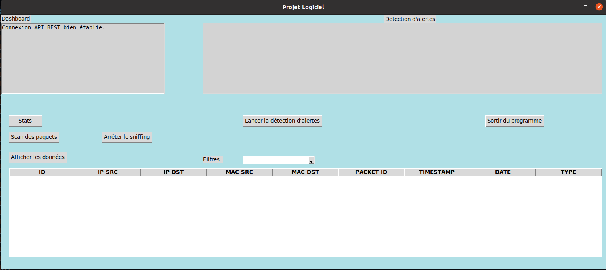

# Manuel d'utilisation
## Presentation de l'interface graphique et ses fonctions

Pour lancer le script et avoir toutes les fonctionalités, il faut le faire en **sudo**, une fois que le module sniff il est présent dans l'interface et il marche qu'en **sudo**.

#### Lancement

