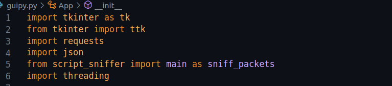
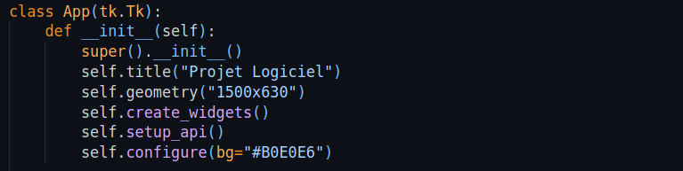
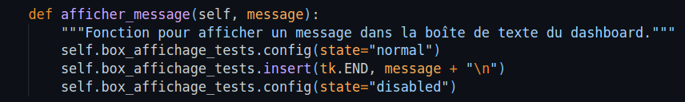
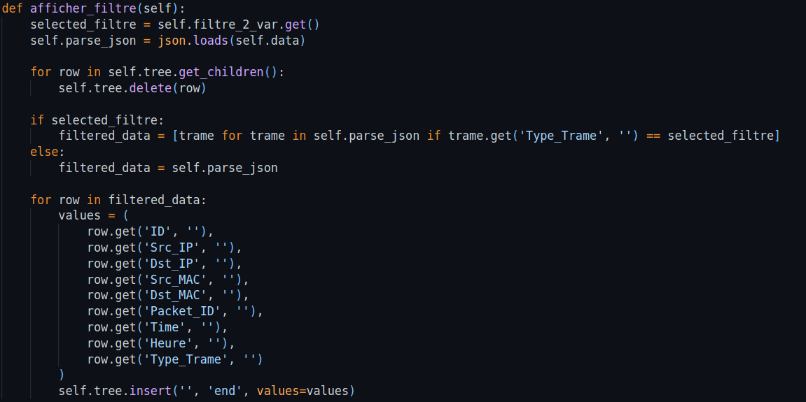
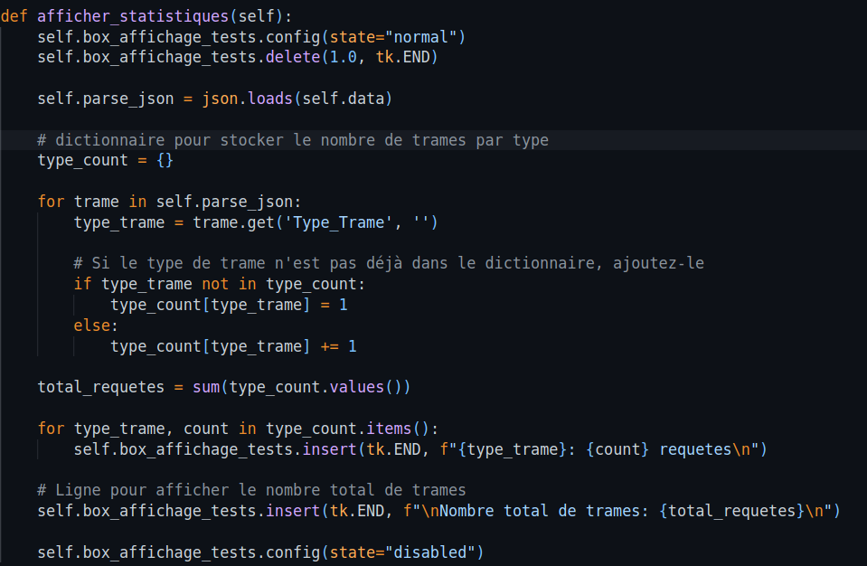
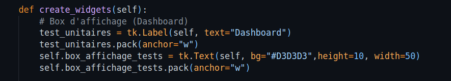

# Description du code
Ce code est une application GUI (Interface Graphique Utilisateur) en utilisant le module Tkinter de Python, le code est basé sur la Programation Orienté au Object, ce qui m'a permis de gagner plus de temps (en appellant les variables partout dans le code) et aussi la propre organisation du code. Il sert pour effectuer une analyse de paquets réseau à l'aide du module script_sniffer, afficher les résultats dans une interface graphique et interagir avec une API REST.

## Partie I
### Modules importés

J'ai importé les modules tkinter, requests, json, et threading. Le module script_sniffer est également importé avec l'alias sniff_packets.

### Definition de Class 'App'

J'ai defini une classe 'App' héritant de 'tk.Tk' [grace au contenu de ce lien](https://www.pierre-giraud.com/python-apprendre-programmer-cours/oriente-objet-heritage-polymorphisme/).
Ensuite j'ai utilisé un constructeur (__init__) que initialise la fenêtre principale avec un titre, une taille et appelle deux méthodes (create_widgets et setup_api) pour créer les composants de l'interface graphique et configurer l'API.

## Partie II
### Definition de Methodes (Fonctions)
#### Méthodes pour Afficher des Informations dans l'Interface

Ces méthodes affichent différents types d'informations dans les zones de texte de l'interface (dashboard), comme des messages, des filtres, et des statistiques sur les trames réseau analysées.
- Affichage de Message

Cette méthode permet d'afficher un message dans une boîte de texte spécifiée (box_affichage_tests) dans l'interface graphique. Elle commence par autoriser la modification de la boîte de texte, y insère le message à la fin suivi d'un saut de ligne, puis désactive à nouveau la possibilité de modification de la boîte de texte. J'ai utilisé cella pour afficher une message lorsque l'API est connecté ou pas, aussi lorsque le script de scan de paquets est lancé ainsi quand il s'est arreté.

- Affichage de données + filtres

J'ai utilisée cette méthode pour filtrer et afficher des données JSON reçues àpartir de l'API Rest dans la structure d'interface utilisateur Tkinter (Treeview). Elle nettoie d'abord la structure, puis filtre les données en fonction de la valeur du filtre sélectionné, et enfin insère les données filtrées dans la structure d'interface utilisateur.

1 - selected_filtre = self.filtre_2_var.get(): Il récupère la valeur actuelle du filtre sélectionné à partir d'une variable Tkinter (filtre_2_var).

2 - self.parse_json = json.loads(self.data): Cette ligne sert à charger les données JSON stockées dans la variable self.data en utilisant la fonction loads du module json. Cela suppose que self.data contient une chaîne JSON valide.

3 - for row in self.tree.get_children(): self.tree.delete(row): Nettoie toutes les lignes actuellement présentes dans la structure d'interface utilisateur (Treeview) pour s'assurer qu'elle est vide avant d'afficher les données filtrées.

4 - if selected_filtre: filtered_data = [trame for trame in self.parse_json if trame.get('Type_Trame', '') == selected_filtre]: Si un filtre est sélectionné, crée une liste appelée filtered_data qui contient uniquement les éléments de self.parse_json dont la clé 'Type_Trame' est égale à la valeur du filtre sélectionné. Sinon, filtered_data est égal à l'ensemble complet de données self.parse_json.

5 - for row in filtered_data: ...: Parcours chaque élément de filtered_data et extrait les valeurs associées aux clés spécifiques ('ID', 'Src_IP', etc.). Ces valeurs sont ensuite insérées dans la structure d'interface utilisateur (Treeview) à la fin de la liste, créant ainsi une nouvelle ligne avec les données filtrées.

- Affichage de statistiques 

Cette méthode affiche des statistiques sur le nombre de trames par type dans la boite de texte (Dashboard). Elle nettoie d'abord la boîte de texte, analyse les données JSON pour compter le nombre de trames par type, affiche ces statistiques dans la boîte de texte, puis affiche le nombre total de trames.

1 - self.box_affichage_tests.config(state="normal"): Cette ligne configure l'état de la boîte de texte box_affichage_tests en "normal", permettant ainsi la modification du texte.

2- self.box_affichage_tests.delete(1.0, tk.END): Supprime tout le contenu actuel de la boîte de texte. Cela est fait pour nettoyer la boîte avant d'afficher de nouvelles statistiques.

3 - self.parse_json = json.loads(self.data): Charge les données JSON stockées dans la variable self.data en utilisant json.loads() pour les transformer en une structure Python (probablement une liste de dictionnaires).

4 - Crée un dictionnaire type_count pour stocker le nombre de trames par type.

5 - Parcourt chaque trame dans self.parse_json et compte le nombre de trames par type en utilisant le dictionnaire type_count.

6 - Calcule le nombre total de requêtes en sommant les valeurs du dictionnaire type_count.

7 - Parcourt le dictionnaire type_count et insère chaque type de trame avec son nombre correspondant dans la boîte de texte.

8 - Ajoute une ligne vide dans la boîte de texte.

9 - Ajoute une ligne indiquant le nombre total de trames.

10 - self.box_affichage_tests.config(state="disabled"): Configure à nouveau l'état de la boîte de texte en "disabled", ce qui signifie que le texte ne peut plus être modifié. Cela est souvent utilisé pour empêcher l'utilisateur d'éditer le contenu de la boîte de texte.

#### Méthode create_widgets
Cette méthode crée et place tous les widgets (éléments graphiques) dans la fenêtre. Cela inclut des boutons, des zones de texte, des combobox, et un tableau (Treeview) pour afficher des données.
 - Zone de texte (Dashboard)

- 

